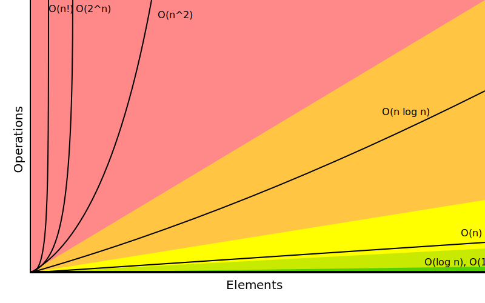

<h1 align="center">Data Structures and Algorithms</h1>

  

## Data Structures
- [x] Stack
- [x] Queue
- [x] Set
- [x] Dictionary
- [x] Hash Table
- [x] Hash Table Linar Probing
- [x] Linked List
- [ ] Doubly Linked List
- [ ] Circular Linked List
- [x] Binary Search Tree

## Algorithms
- [x] Circular
- [x] fibonacci
- [x] fromlast
- [x] mindpoint
- [ ] Buble Sort
- [ ] Insertion Sort
- [ ] Merge Sort
- [ ] Selection Sort
- [ ] Quick Sort

## Asymptotic analysis

### Big O Notation
> Big O notation is a mathematical notation that describes the limiting behaviour of a function when the argument tends towards a particular value or infinity.

  

## Links

#### Courses
- [coding interview bootcamp algorithms and data structure](https://www.udemy.com/coding-interview-bootcamp-algorithms-and-data-structure/)
- [UNIVESP - Engenharia de Computação - Estrutura de Dados](https://www.youtube.com/watch?v=y0B-vQI6Tiw&list=PLxI8Can9yAHf8k8LrUePyj0y3lLpigGcl)

#### Books

- [Learning JavaScript Data Structures and Algorithms](https://www.amazon.com.br/Learning-JavaScript-Data-Structures-Algorithms/dp/1783554878)

#### Articles
- [Mathematical analysis](https://www.wikiwand.com/en/Mathematical_analysis)
- [Big O notation](https://www.wikiwand.com/en/Big_O_notation)
- [What's the best way to explain big-O notation in laymen's terms?](https://www.quora.com/Whats-the-best-way-to-explain-big-O-notation-in-laymens-terms/answer/Gayle-Laakmann-McDowell?srid=BNgz)